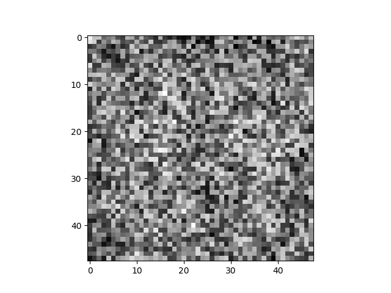

# Facial Age Estimation

This project involves implementing and training a 3-layer neural network to estimate a person's age based on a 48x48 pixel face image. The neural network takes a 2304-dimensional input (flattened image) and outputs a scalar value representing the predicted age.

## Overview

The network follows the architecture:

1. **Layer 1**: Input -> z = W(1) * x + b(1)
2. **Layer 2**: h = relu(z)
3. **Layer 3**: ŷ = W(2) * h + b(2)

Where:
- x is the input image vector (flattened).
- W(1) and W(2) are weight matrices.
- b(1) and b(2) are bias terms.
- The activation function used is the ReLU function.

The training and testing data can be found in `data.zip`.

### Loss Function

The loss function used is **Mean Squared Error (MSE)**, which is applied to the predicted and true age values. The network is trained using **Stochastic Gradient Descent (SGD)**, and backpropagation is implemented to compute gradients.

## Visualizing Trained Weight Vectors

After optimizing the neural network weights, we visualize the learned weight vectors for the first layer of the network. Each weight vector corresponds to a 48x48-pixel image, representing the features learned for the faces in the training data.

The following images display the trained weight vectors:

<div style="display: grid; grid-template-columns: repeat(5, 1fr); gap: 10px;">
    
    
    
    
    
    
    
    
    
    
    
    
    
    
    
    
    
    
    
    
    
    
    
    
    
    
    
    
    
    
</div>

## Dependencies

This project requires the following Python libraries:

- `numpy`
- `matplotlib`

You can install them using pip:

```bash
pip install numpy matplotlib
```

## Run Instructions
Run the main script to train and evaluate the model:  
```bash
python age.py
```
